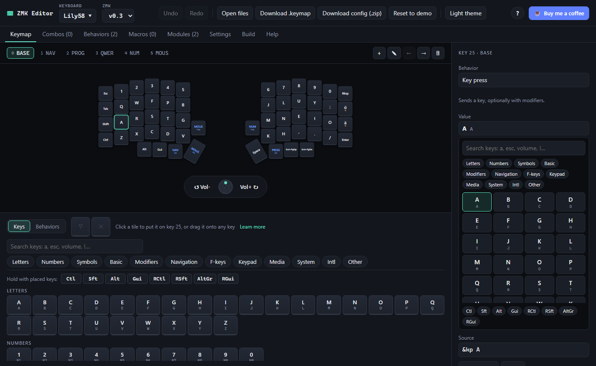
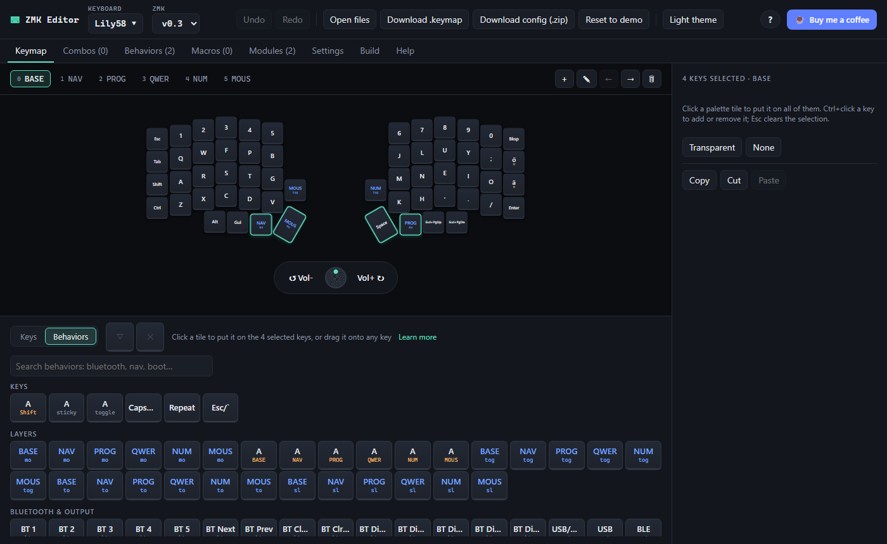
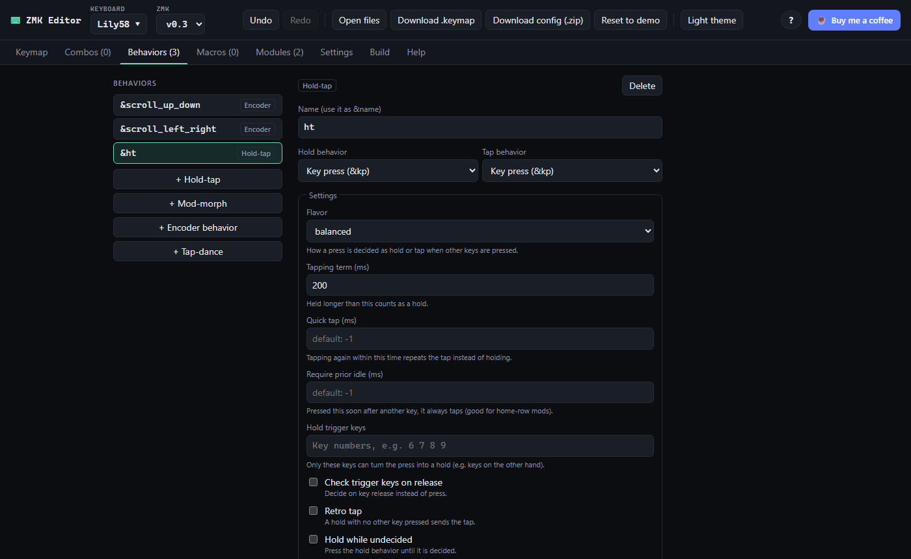
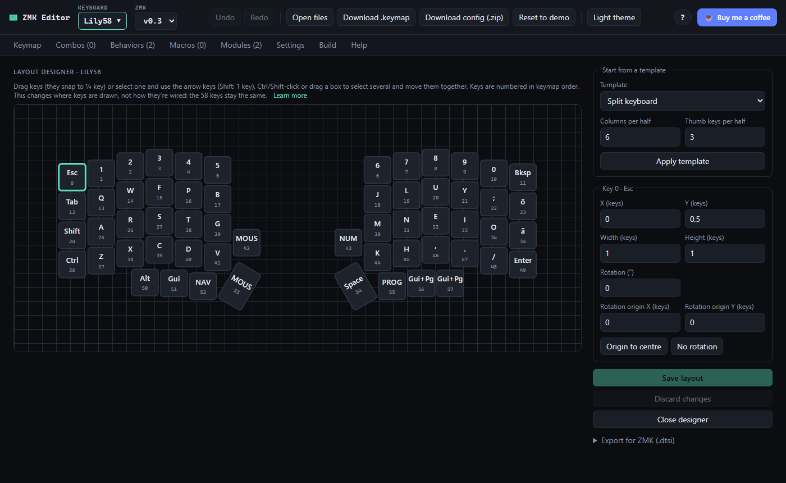
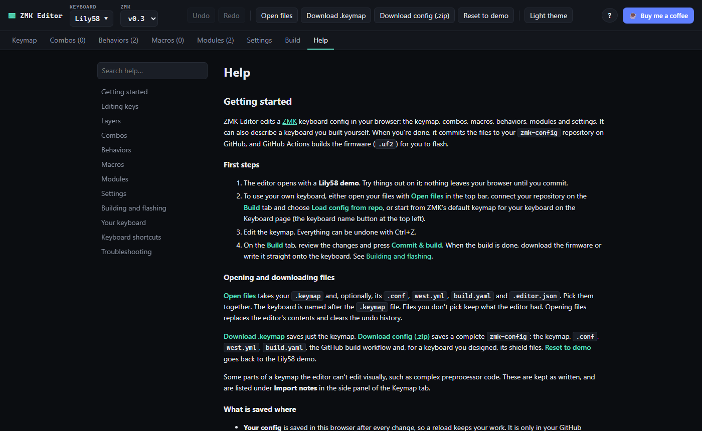

# ZMK Editor

A visual editor for [ZMK](https://zmk.dev) keyboard configs, in the browser. Edit your keymap by dragging keys around, set up combos, macros, hold-taps and modules, or describe a keyboard you built yourself, then commit to your `zmk-config` repository and let GitHub Actions build the firmware.

**[Open the editor →](https://ooepi.github.io/zmk-editor/)**

Nothing to install. Your work stays in your browser until you commit it.

<a href="https://www.buymeacoffee.com/gristone"></a>



## What it does

- **Edit keys visually.** Drag keys and behaviors from the palette onto the keyboard, or select keys and click a tile. A searchable side panel handles everything else: hold-taps, layer keys, Bluetooth, mouse keys, lighting and Unicode characters. The palette remembers what you used recently.
- **Work on many keys at once.** Ctrl+click or drag a box to select keys, then change them all together. Copy and paste keys between layers, or drag a key onto a layer tab to copy it there.
- **Layers.** Add, rename, delete and drag to reorder them. Keys that switch layers keep pointing at the right layer. Conditional layers (Lower + Raise = Adjust) too.
- **Combos, macros and behaviors.** Combos, macros (type text and it becomes key steps), hold-taps, mod-morphs, tap-dances and encoder behaviors, all with forms instead of devicetree code.
- **Encoders.** Set what each knob does per layer, and drop keys onto either direction.
- **Modules.** Add Unicode (ä, ö, å…), auto layer, leader key, adaptive keys, display widgets and more. Each is pinned to the release that matches your ZMK version, or you can find others on GitHub.
- **Settings.** Sleep, Bluetooth, battery, RGB, backlight, display and more, explained in plain words and written to your `.conf`. It warns when a setting doesn't match your keymap or hardware.
- **Build and flash.** Log in with GitHub (or use a token), review the changes, and commit. The editor follows the GitHub Actions build and hands you the `.uf2`. In Chrome and Edge it can write the file straight onto the keyboard.
- **Any ZMK keyboard, or your own.** Start from ZMK's default keymap for any of its keyboards (Corne, Sofle, Kyria, Lily58…). Adjust how keys are drawn in the layout designer. Or describe a handwired or PCB keyboard (Pro Micro nRF52840, matrix or direct wiring, split or one piece, encoders, nice!view or OLED), and the editor writes its ZMK shield files.
- **Print a cheat sheet.** Every layer as a clean diagram, plus your combos, to print or save as PDF, handy while you learn a new layout.
- **Undo everything.** Every change, including modules and version switches, can be undone.

| Several keys at once | Hold-tap settings | Layout designer |
| --- | --- | --- |
|  |  |  |

## Quick start

1. [Open the editor](https://ooepi.github.io/zmk-editor/). It starts with a Lily58 demo you can try things on.
2. Bring in your keyboard:
   - On the **Build** tab, connect your `zmk-config` repository and choose **Load config from repo**.
   - Or use **Open files** to pick your `.keymap` (and `.conf`, `west.yml`…).
   - Or use **Open from GitHub** to open any public `zmk-config` repository, no login needed.
   - Or click the keyboard name at the top left to start from ZMK's default keymap for your keyboard.
3. Edit away. **Help** (the tab, or **?** at the top right) explains every feature, and "Learn more" links throughout the app open the relevant section.
4. On the **Build** tab, press **Commit & build**, wait a few minutes, then write the firmware to your keyboard.

No `zmk-config` repository yet? Create one from [ZMK's template](https://github.com/zmkfirmware/unified-zmk-config-template), or use **Download config (.zip)** to get a complete one from the editor.



## Development

Requires Node 22.

```sh
npm install
npm run dev          # start the app at http://localhost:5173
npm test             # unit, UI and fixture tests
npm run lint
npm run typecheck
npm run build        # production build in dist/
npm run screenshots  # rebuild and recapture the README screenshots in docs/images/
```

`npm run screenshots` uses [Playwright](https://playwright.dev). The first time, download its browser with `npx playwright install chromium`.

Design notes for each feature are in [`docs/specs/`](docs/specs), and their implementation plans are in [`docs/plans/`](docs/plans).

## Project layout

- `src/core/`: framework-free logic, which must not import React:
  - `dts/`: the devicetree parser and printer.
  - `keymap/`: the keymap model, importer and generator, and every edit (layers, keys, clipboard, palette rules, combos, behaviors, encoders).
  - `catalog/`: keycodes, behaviors, modules, settings, Unicode and keyboards.
  - `files/`: `.conf`, `west.yml`, `build.yaml` and the workflow files.
  - `hardware/`: shield generation for designed keyboards.
  - `layouts/`: physical layouts.
  - `github/`: the GitHub API client.
  - `config.ts`: the whole-repo model.
- `src/ui/`: the React app:
  - `components/`: the views and panels.
  - `state/`: the editor reducer (with undo), storage and preferences.
  - `help/`: the in-app guide, with one file per topic in `help/sections/`.
  - `shortcuts.ts`: the one list of keyboard shortcuts, checked against the handler by a test.
- `worker/`: the "Log in with GitHub" helper (Cloudflare Worker).
- `scripts/`:
  - `gen-keycodes.mjs`: generates the keycode catalog.
  - `gen-unicode.mjs`: generates the Unicode alias catalog.
  - `gen-keyboards.ts`: generates the keyboard catalog. Run it on a ZMK checkout: `node scripts/gen-keyboards.ts /path/to/zmk v0.3`.
  - `screenshots.ts`: captures the README screenshots.
- `test/fixtures/lily58/`: a real, working Lily58 config.
- `test/generated/lily58/`: what the editor generates from that fixture.
  - The tests fail if it goes stale. Update it with `npx vitest run -u`.
  - `.github/workflows/firmware.yml` builds it with ZMK to prove it compiles.

## Deploying

`.github/workflows/pages.yml` deploys `main` to GitHub Pages. To enable it, go to Settings → Pages and set Source to GitHub Actions. Pages on a private repository needs a paid GitHub plan.

"Log in with GitHub" needs a GitHub App and a small login helper on Cloudflare Workers ([`worker/`](worker)). See [docs/github-login-setup.md](docs/github-login-setup.md). Without them, the Build tab uses a personal access token instead.
